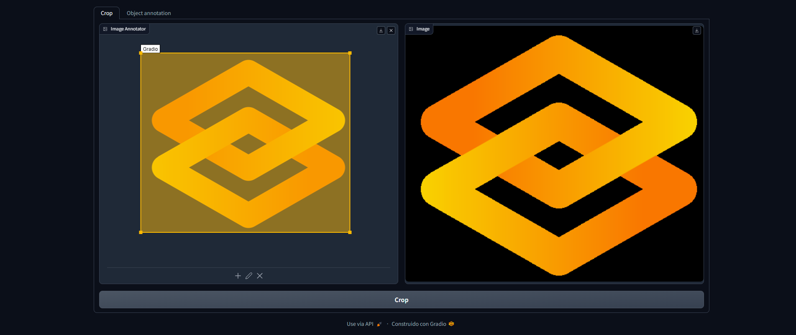
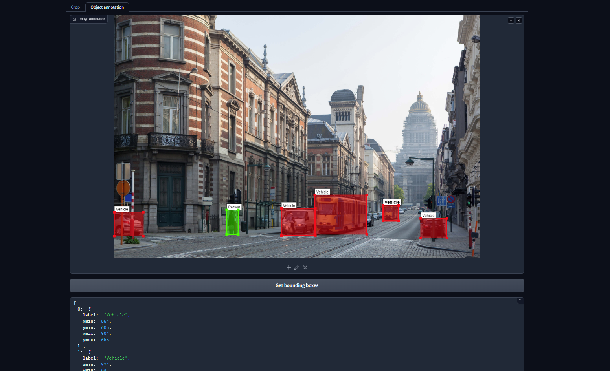

# Gradio Image Annotator
A Gradio component to annotate images with bounding boxes.

## Requirements
- gradio>=4.0


## Installation
```
pip install gradio_image_annotator
```

## Usage

```Python
from gradio_image_annotator import image_annotator
image_annotator(···)
```

## Development
```
cd gradio_image_annotator
gradio cc install
gradio cc dev
```

## Build from source
```
cd gradio_image_annotator
gradio cc install
gradio cc build
```

## Example usage

```python
import gradio as gr
from gradio_image_annotator import image_annotator

example = {
    "image": "https://raw.githubusercontent.com/gradio-app/gradio/main/guides/assets/logo.png",
    "boxes": [
        {
            "xmin": 30,
            "ymin": 70,
            "xmax": 530,
            "ymax": 500,
            "label": "Gradio",
            "color": (250, 185, 0),
        }
    ]
}

def crop(annotations):
    if annotations["boxes"]:
        box = annotations["boxes"][0]
        return annotations["image"][
            box["ymin"]:box["ymax"],
            box["xmin"]:box["xmax"]
        ]
    return None

def get_boxes_json(annotations):
    return [
        {k: box[k]
            for k in box if k in ("xmin", "ymin", "xmax", "ymax", "label")}
        for box in annotations["boxes"]
    ]


with gr.Blocks() as demo:
    with gr.Tab("Crop"):
        with gr.Row():
            annotator_crop = image_annotator(example, image_type="numpy")
            image_crop = gr.Image()
        button_crop = gr.Button("Crop")
        button_crop.click(crop, annotator_crop, image_crop)
    with gr.Tab("Object annotation"):
        annotator = image_annotator(
            {"image": "https://gradio-builds.s3.amazonaws.com/demo-files/base.png"},
            label_list=["Person", "Vehicle"],
            label_colors=[(0, 255, 0), (255, 0, 0)],
        )
        button_get = gr.Button("Get bounding boxes")
        json_boxes = gr.JSON()
        button_get.click(get_boxes_json, annotator, json_boxes)


if __name__ == "__main__":
    demo.launch()
```

## Screenshots


